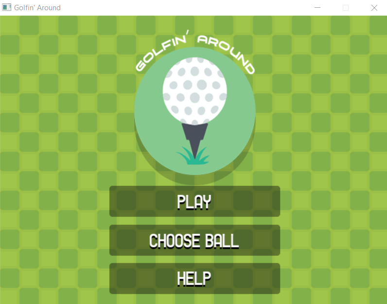

# Thành viên
- Mai Ngọc Duy - 21020512: https://github.com/AESir2412

# Bài tập lớn LTNC - Thiết kế game tự chọn sử dụng C++ và SDL 2.0 (Golfin' Around) 

Trong bài tập lớn này, em đã sử dụng các kiến thức cơ bản về C++ và SDL để xây dựng game Mini-Golf (lấy tên Golfin' Around)

Trên đây là hình ảnh mô phỏng giao diện trò chơi.

## Giới thiệu
Lấy cảm hứng từ bộ môn Golf, Golfin' Around mô phỏng lại môn thể thao này dưới dạng 1 trò chơi. Người chơi có thể chọn bóng để bắt đầu trong số các lựa chọn:

Sau khi bắt đâu, người chơi ấn và kéo thả quả bóng vào vị trí như mũi tên, điều chỉnh lực sao cho hợp lý. Ngoài ra ở các map có một số chướng ngại vật và vật cản đặc biệt có thể thấy như dưới:

Sau đó thực hiện đánh bóng vào bị trí lỗ được sắp đặt.

Hiện tại trò chơi có 5 map, người lập trình hoàn toàn có thể tạo thêm theo mong muốn dựa trên các map sẵn có. Hoàn thành 5 lỗ dưới 100 phát đánh sẽ chiến thắng :D !

## Trích dẫn 
Game này được phát triển dựa trên game của PolyMars (Link: https://www.youtube.com/watch?v=iEn0ozP-jxc)

